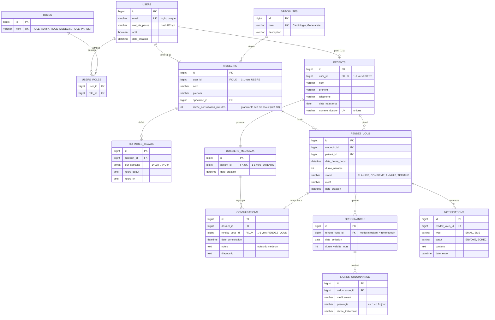

# Conception — API Gestion de Clinique Médicale

---

## 1. Diagramme de base de données



### Cardinalités

| Relation | Cardinalité | Sens |
|---|---|---|
| `users` ↔ `roles` | **N..N** (via `users_roles`) | Un utilisateur a un ou plusieurs rôles |
| `users` ↔ `medecins` | **1..1** | Un compte = un profil médecin (optionnel) |
| `users` ↔ `patients` | **1..1** | Un compte = un profil patient (optionnel) |
| `specialites` → `medecins` | **1..N** | Une spécialité regroupe plusieurs médecins |
| `medecins` → `horaires_travail` | **1..N** | Un médecin a plusieurs plages hebdo |
| `medecins` → `rendez_vous` | **1..N** | Un médecin a plusieurs rendez-vous |
| `patients` → `rendez_vous` | **1..N** | Un patient a plusieurs rendez-vous |
| `patients` → `dossiers_medicaux` | **1..1** | Un patient a un dossier unique |
| `dossiers_medicaux` → `consultations` | **1..N** | Un dossier regroupe les consultations |
| `rendez_vous` ↔ `consultations` | **1..1** | Un RDV terminé donne une consultation |
| `rendez_vous` → `ordonnances` | **1..N** | Un RDV peut générer des ordonnances |
| `ordonnances` → `lignes_ordonnance` | **1..N** | Une ordonnance liste plusieurs médicaments |
| `rendez_vous` → `notifications` | **1..N** | Un RDV déclenche des rappels |

---

## 2. Architecture en couches

```
com.clinique.api
├── ClinicApiApplication.java
├── config/          SecurityConfig · OpenApiConfig · DataInitializer (seed rôles/admin)
├── security/        JwtService · JwtAuthFilter · CustomUserDetailsService · UserDetailsImpl
├── model/           Entités JPA + enums (StatutRendezVous, TypeNotification, StatutNotification)
├── repository/      Interfaces Spring Data JPA
├── dto/
│   ├── request/     *Request (entrées validées avec Jakarta Validation)
│   └── response/    *Response (sorties, jamais l'entité brute)
├── service/         Logique métier
├── controller/      Endpoints REST (@RestController)
├── scheduler/       RappelScheduler (@Scheduled — rappels 24 h avant)
└── exception/       GlobalExceptionHandler + exceptions métier
```

---

## 3. DTOs prévus

| DTO | Champs principaux |
|---|---|
| `RegisterRequest` | nom, prenom, email, motDePasse, telephone, dateNaissance |
| `LoginRequest` | email, motDePasse |
| `MedecinRequest` | nom, prenom, email, motDePasse, specialiteId, dureeConsultationMinutes, horaires[] |
| `HoraireTravailRequest` | jourSemaine, heureDebut, heureFin |
| `SpecialiteRequest` | nom, description |
| `RendezVousRequest` | medecinId, dateHeureDebut |
| `ChangerStatutRequest` | statut |
| `ConsultationRequest` | rendezVousId, notes, diagnostic |
| `OrdonnanceRequest` | rendezVousId, dureeValiditeJours, lignes[] |
| `LigneOrdonnanceRequest` | medicament, posologie, dureeTraitement |

**Réponses (`dto/response`)**

| DTO | Rôle |
|---|---|
| `AuthResponse` | token, type=`Bearer`, expiresIn, roles, userId |
| `MedecinResponse` / `PatientResponse` | profils exposés (sans mot de passe) |
| `RendezVousResponse` | détail RDV + médecin/patient résumés |
| `CreneauDisponibleResponse` | heureDebut, heureFin (sortie du moteur de dispo) |
| `OrdonnanceResponse` / `DossierResponse` | données médicales filtrées par rôle |
| `ApiError` | timestamp, status, message, path, erreurs[] (format d'erreur uniforme) |

---

## 4. Matrice RBAC

| Domaine | Endpoint (exemple) | ADMIN | MEDECIN | PATIENT |
|---|---|:---:|:---:|:---:|
| Auth | `POST /api/auth/register`, `/login` | public | public | public |
| Spécialités | `CRUD /api/specialites` | ✅ | lecture | lecture |
| Médecins | `CRUD /api/medecins` | ✅ | son profil | lecture |
| Patients | `CRUD /api/patients` | ✅ | lecture | son profil |
| Disponibilités | `GET /api/medecins/{id}/disponibilites?date=` | ✅ | ✅ | ✅ |
| Horaires médecin | `PUT /api/medecins/{id}/horaires` | ✅ | les siens | ❌ |
| Rendez-vous | `POST /api/rendez-vous` (prise) | ✅ | ❌ | ✅ (le sien) |
| Rendez-vous | `PATCH /api/rendez-vous/{id}/statut` | ✅ | les siens | annuler le sien |
| Dossier médical | `GET /api/dossiers/{patientId}` | ✅ | ✅ (tous) | ✅ (le sien) |
| Ordonnances | `POST /api/ordonnances` | ✅ | médecin traitant seulement | ❌ |
| Ordonnances | `GET /api/ordonnances/mes` | ✅ | les siennes | les siennes |
